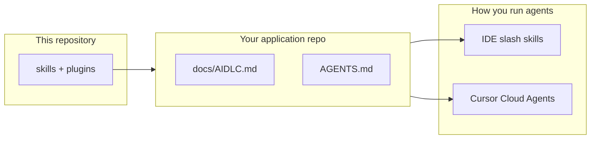
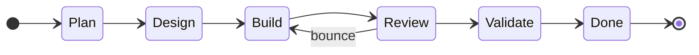
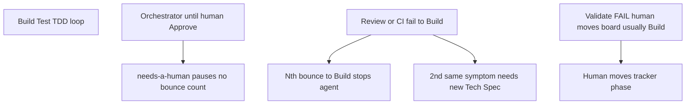
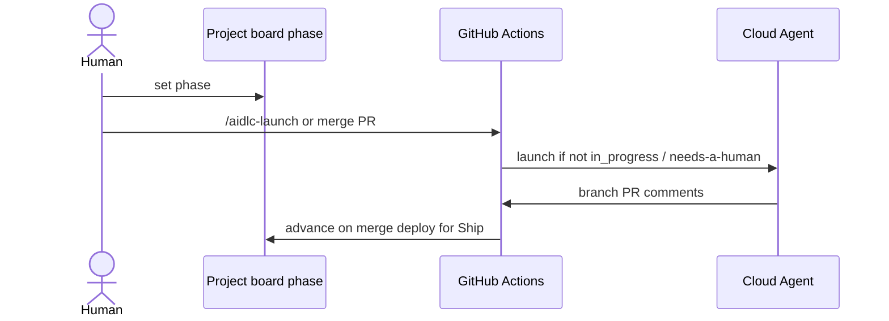

# AI-DLC

**AI-DLC** is the public **skills and agents library** for the AI Development Lifecycle (AIDLC): phase orchestrators (`/plan`, `/design`, `/build`, `/review`, `/ship`, `/learn`), domain skills (architecture, testing, backend, frontend, …), and agent bundles. It ships as a **Claude Code** and **Cursor team** marketplace (see [`.cursor-plugin/marketplace.json`](.cursor-plugin/marketplace.json)) and works with Cursor via symlinked skill directories or the team plugin UI.

**What is this repo? A seed.** There are many ways to do agentic orchestration — different LLMs, platforms, and issue trackers. This repository gives you a **pattern** (V-model, human gates, orchestrator rhythm) and **artifacts** you can adapt: copy process into your app repo, pick skills only, or wire full headless automation. GitHub Actions + Projects, Linear workflow states, or manual slash commands in the IDE all work; see [docs/GETTING-ORIENTED.md](docs/GETTING-ORIENTED.md).

**New here?** Read [Getting oriented](docs/GETTING-ORIENTED.md) for diagrams (V-model vs tracker phases, feedback loops, sequence flows). Copy [docs/templates/AIDLC.md](docs/templates/AIDLC.md) into your product repo as `docs/AIDLC.md` when you adopt the process.

---

## At a glance

| Layer | Where it lives | You choose |
|-------|----------------|------------|
| **Process** | Consumer `docs/AIDLC.md` + `AGENTS.md` | Wording, gates, tracker names |
| **Skills** | This repo `skills/` → your IDE or submodule | All phases or a subset |
| **Transport** | Optional GitHub / Linear playbooks in `docs/` | Manual chat vs board-driven Cloud Agents |



---

## V-model vs tracker phases (two ideas)

**V-model (theory)** — correspondence only (horizontal lines = “verify against,” not a board move). Monospace:

```text
Plan ───────────────────────── Validate (+ Learn)
  │                                    │
Design ─────────────── Review
  │                            │
 Build ────────── Test
           └── TDD ──┘
```

Full diagram + table: [docs/GETTING-ORIENTED.md](docs/GETTING-ORIENTED.md#the-v-model-theory--not-your-board).

**Tracker state machine** — what your board column actually advances (common rework: **Review → Build** only):



TDD runs **inside** Build; `/learn` runs after Validate PASS. If Validate fails, `/ship` reports against the Product Spec and a **human moves the board** (usually back to Build). Details: [docs/GETTING-ORIENTED.md](docs/GETTING-ORIENTED.md).

| Slash skill | Phase | Main output |
|-------------|-------|-------------|
| `/plan` | Plan | Product Spec |
| `/design` | Design | Tech Spec per Unit |
| `/build` | Build + Test | PR + green CI |
| `/review` | Review | Spec trace, human approval |
| `/ship` | Validate | Scorecard **against** Product Spec |
| `/learn` | Learn (after PASS) | ADRs, docs, retro |

---

## Feedback loops and circuit breakers

Some loops are **by design** (TDD, orchestrator draft until you approve). Others need **breakers** so headless runs do not churn forever.



| Mechanism | Purpose |
|-----------|---------|
| **Bounce breaker** | After N returns to Build+Test, stop and assign a human ([Linear playbook](docs/LINEAR-AIDLC-PROJECT.md)) |
| **`needs-a-human`** | Ask on the ticket, halt until answered — not a phase bounce ([ASK-AND-HALT.md](docs/ASK-AND-HALT.md)) |
| **Architectural soundness** | Block runtime guards that should be impossible states ([ARCHITECTURAL-SOUNDNESS.md](docs/ARCHITECTURAL-SOUNDNESS.md)) |

Full diagram set and sequence charts: [docs/GETTING-ORIENTED.md](docs/GETTING-ORIENTED.md).

---

## Headless automation (sequence)

Recommended GitHub path: Projects v2 **AIDLC phase** field + workflow templates → Cursor Cloud Agent. Humans still move gates; Actions dispatch agents and advance phase on merge.



Setup: [docs/GITHUB-AIDLC-QUEUE.md](docs/GITHUB-AIDLC-QUEUE.md). Linear-native variant: [docs/LINEAR-AIDLC-PROJECT.md](docs/LINEAR-AIDLC-PROJECT.md).

---

## Quick install

```bash
curl -fsSL https://raw.githubusercontent.com/queen-of-code/AI-DLC/main/install.sh | bash
```

This clones to `~/.ai-dlc` and links skills into `~/.cursor/skills` and `~/.claude/skills`.

## Claude Code marketplace

```bash
/plugin marketplace add /path/to/AI-DLC
/plugin install ai-dlc-skills@ai-dlc
```

See [docs/CLAUDE-MARKETPLACE.md](docs/CLAUDE-MARKETPLACE.md).

## Docs

| Doc | Description |
|-----|-------------|
| [docs/GETTING-ORIENTED.md](docs/GETTING-ORIENTED.md) | **Start here** — diagrams, adoption paths, agent hints |
| [docs/SKILLS.md](docs/SKILLS.md) | Bundle format, manifest schema, skill catalog |
| [docs/INSTALL.md](docs/INSTALL.md) | Install paths and updates |
| [docs/CLAUDE-MARKETPLACE.md](docs/CLAUDE-MARKETPLACE.md) | Claude Code & Cursor marketplace usage |
| [docs/CONSUMER-SETUP.md](docs/CONSUMER-SETUP.md) | Submodule, overrides, UI validation environments |
| [docs/INTERACTIVE-UI-VALIDATION.md](docs/INTERACTIVE-UI-VALIDATION.md) | Chrome DevTools MCP UI validation (not the Validate phase) |
| [docs/templates/AIDLC.md](docs/templates/AIDLC.md) | Copy into consumer `docs/AIDLC.md` |
| [docs/GITHUB-AIDLC-QUEUE.md](docs/GITHUB-AIDLC-QUEUE.md) | **Recommended:** Projects v2 queue + Cursor workflow templates |
| [docs/GITHUB-AIDLC-PROJECT.md](docs/GITHUB-AIDLC-PROJECT.md) | GitHub automation tiers + classic/cron legacy |
| [docs/ISSUE-TRACKER-PORTABILITY.md](docs/ISSUE-TRACKER-PORTABILITY.md) | Declare GitHub / Linear / Jira in consumer `AGENTS.md`; setup agent |
| [docs/LINEAR-AIDLC-PROJECT.md](docs/LINEAR-AIDLC-PROJECT.md) | Linear-native transport: workflow states = phases, specs as Documents, slices born inert, bot @mentions |
| [docs/ARCHITECTURAL-SOUNDNESS.md](docs/ARCHITECTURAL-SOUNDNESS.md) | Tracker-neutral: prevent invalid states by construction; Design/Review/Build enforcement |
| [docs/INTENT-OVER-LITERAL.md](docs/INTENT-OVER-LITERAL.md) | Examples illustrate, they don't specify — no special-casing to match a sample; disclose deviations; blocking review test |
| [docs/ASK-AND-HALT.md](docs/ASK-AND-HALT.md) | Headless runs still ask — on the work item, @mention a human, `needs-a-human`, halt until answered |
| [AGENTS.md](AGENTS.md) | Contributor / agent instructions |

## Layout

- **`skills/`** — All skill and agent bundles (`SKILL.md` + optional `tool.ts`, `system-prompt.md`).
- **`skills/spec-management/templates/`** — **Product Spec**, **Tech Spec**, **ADR** template (`adr-template.md`), and **ADR folder** guidance (`adr-guidance.md`) — all packaged with the `spec-management` skill / plugin.
- **`agent-library-mcp/`** — Manifest validation and CI helpers (`npm run validate-manifests`).
- **`.claude-plugin/marketplace.json`** — Claude Code marketplace catalog.
- **`.cursor-plugin/marketplace.json`** — Cursor team marketplace catalog (`metadata.pluginRoot`: `plugins`).
- **`plugins/ai-dlc-skills/`** — `.claude-plugin/` + `.cursor-plugin/` manifests and copy of `skills/` (synced via `./scripts/sync-plugin-skills.sh`).
- **`scripts/`** — `aidlc-cron.sh`, `prompts/`, `launchd/` examples for GitHub + Claude automation ([docs/GITHUB-AIDLC-PROJECT.md](docs/GITHUB-AIDLC-PROJECT.md)); `validate-cursor-marketplace.mjs` checks the Cursor team marketplace layout ([docs/CLAUDE-MARKETPLACE.md](docs/CLAUDE-MARKETPLACE.md)).

## License

See [LICENSE](LICENSE).
