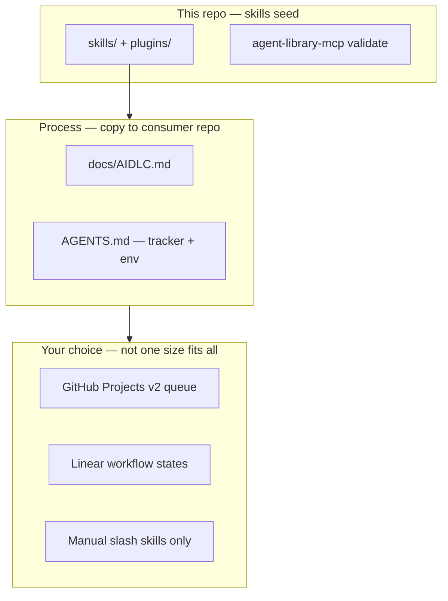
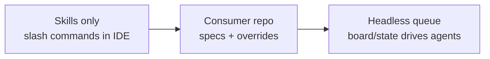
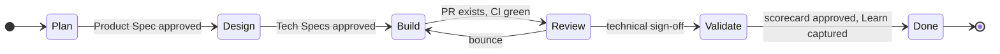
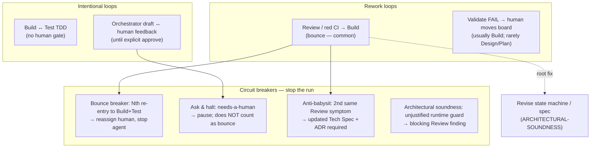
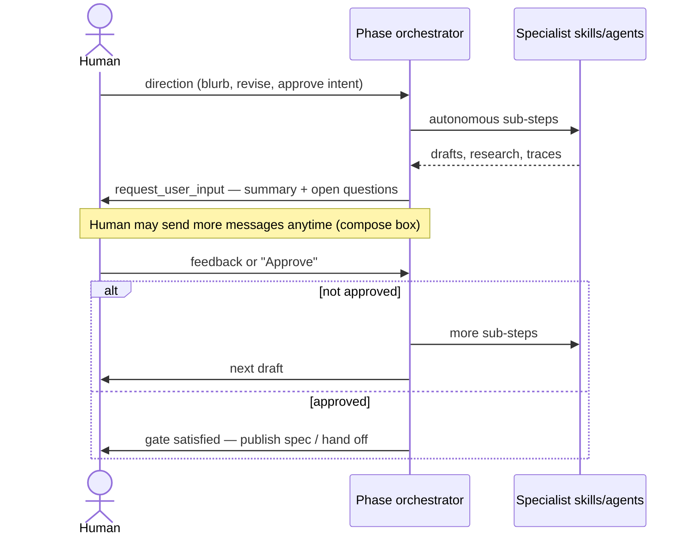
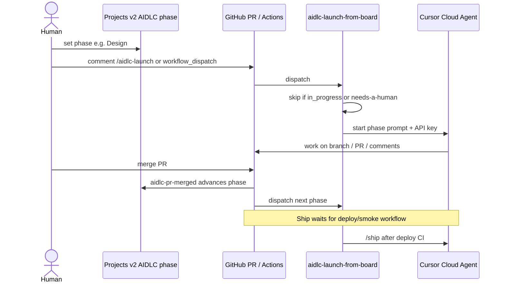
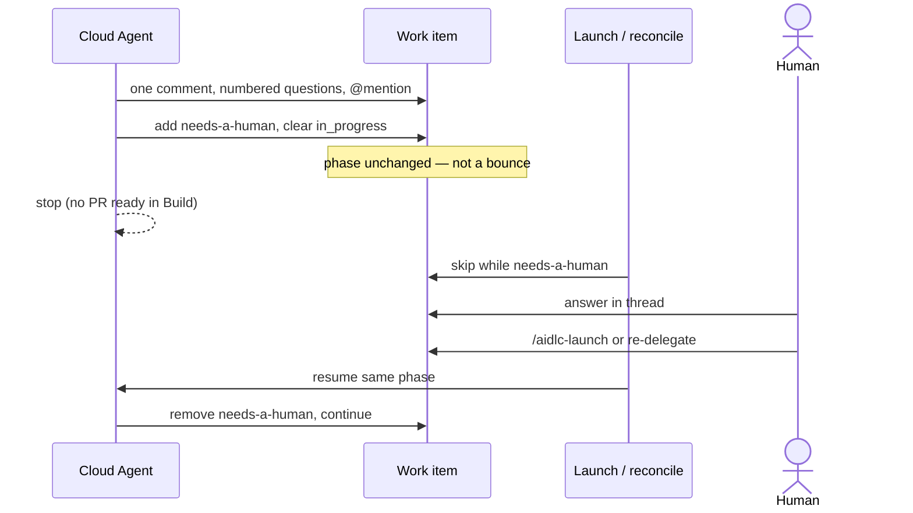
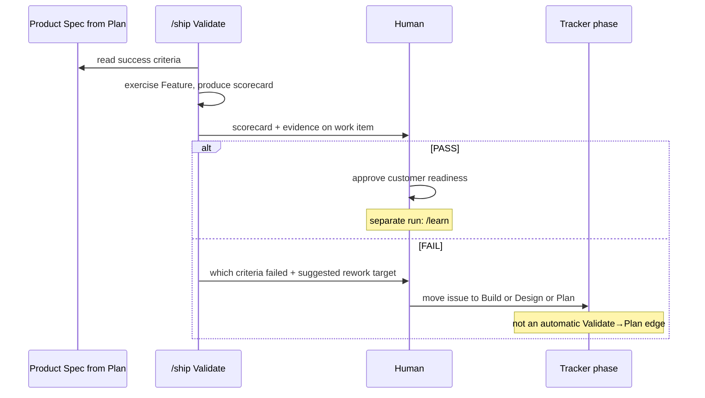
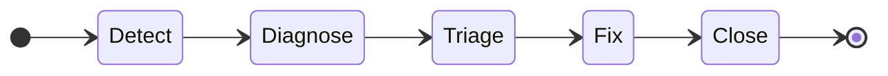
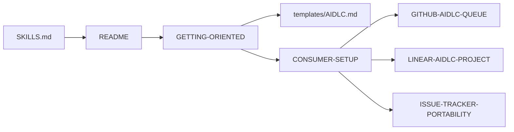

# Getting oriented to AI-DLC

This page is the **picture book** for the repository: what the seed is, how adoption paths differ, how a Feature moves through phases, where feedback loops and **circuit breakers** live, and how headless automation fits. Humans start here; agents should read consumer **`docs/AIDLC.md`** (from [templates/AIDLC.md](templates/AIDLC.md)) plus **`AGENTS.md`** in the app repo.

**Shorter entry point:** [README](../README.md).

---

## What this repository is (and is not)

| | |
|---|---|
| **Is** | A **seed library** of AIDLC phase skills (`/plan` … `/learn`), domain skills, agent bundles, manifest validation, and **optional** GitHub / Linear playbooks |
| **Is not** | A hosted orchestrator, control plane, or “run AIDLC for me” SaaS — you wire skills into **your** LLM platform (Cursor, Claude Code, Cloud Agents, Actions, Jenkins, …) |
| **Goal** | Give you a **pattern** (V-model, human gates, orchestrator rhythm) and **copy-paste artifacts** so you adapt transport without re‑inventing process |

Think of three layers:



---

## Who does what

| Role | Typical first step | Deep dive |
|------|-------------------|-----------|
| **Individual developer** | `curl` install or marketplace plugin; invoke `/plan` in chat | [INSTALL.md](INSTALL.md), [CLAUDE-MARKETPLACE.md](CLAUDE-MARKETPLACE.md) |
| **Team on an app repo** | Submodule + copy `docs/AIDLC.md`; declare tracker in `AGENTS.md` | [CONSUMER-SETUP.md](CONSUMER-SETUP.md) |
| **Headless / Cloud Agents** | Projects v2 or Linear states + workflow templates | [GITHUB-AIDLC-QUEUE.md](GITHUB-AIDLC-QUEUE.md), [LINEAR-AIDLC-PROJECT.md](LINEAR-AIDLC-PROJECT.md) |
| **Contributor to this repo** | [AGENTS.md](../AGENTS.md), [SKILLS.md](SKILLS.md) | Change skills → sync plugin, validate manifests |

---

## Adoption paths (pick your depth)



| Depth | You get | You skip |
|-------|---------|----------|
| **1 — Skills** | Phase orchestrators + domain skills in Cursor / Claude | Tracker automation, mutex labels, deploy-gated Ship |
| **2 — Consumer** | Pinned submodule, `docs/AIDLC.md`, specialist overrides in `.cursor/skills` | Optional until you want unattended runs |
| **3 — Transport** | Phase on board/state launches Cloud Agent; PR events advance phase | Nothing — this is the full hands-off pattern (still human gates on transitions) |

Cross-cutting rules apply at every depth: [ARCHITECTURAL-SOUNDNESS.md](ARCHITECTURAL-SOUNDNESS.md), [INTENT-OVER-LITERAL.md](INTENT-OVER-LITERAL.md), [ASK-AND-HALT.md](ASK-AND-HALT.md).

---

## The V-model (theory — not your board)

The **V-model** is separate from the **tracker state machine** (next section). It shows *correspondence*: each phase on the right **checks against** the artifact from the matching phase on the left. Horizontal ties mean “read and compare,” not “run that phase again.”

Use a **fixed-width** view (this block is plain monospace — copy matches [templates/AIDLC.md](templates/AIDLC.md)):

```text
Plan ─────────────────────────────────── Validate (+ Learn)
  │  Define the problem · Product Spec   Verify it matches · scorecard
  │                                                   │
Design ─────────────────────────────── Review
  │  Tech Spec                         vs Tech Spec
  │                                       │
 Build ─────────────────────── Test
        Do the work · agents implement    Prove it works
                  │         │
                  └── TDD ──┘
              (automated loop — no human gate)
```

**How to read it**

| Left (define) | Right (verify) | What the verify phase uses |
|---------------|----------------|----------------------------|
| **Plan** | **Validate** (+ **Learn** after PASS) | Approved **Product Spec** — success criteria, outcomes |
| **Design** | **Review** | **Tech Spec(s)** — architecture, acceptance criteria |
| **Build** | **Test** | Code + tests from Build; integration proof before Review |

**Time order** (walk the V down then up): Plan → Design → Build ↔ Test → Review → Validate → Done. **`/learn`** often runs as its own headless step after Validate PASS; Learn still belongs on the right leg with Validate because it captures what the cycle taught.

> **Agents implement. Orchestrators coordinate. Humans decide.**

Canonical prose: [templates/AIDLC.md](templates/AIDLC.md) § The V-Model.

---

## Tracker phase flow (state machine)

This is what moves on a **board or workflow state**: one Feature (or slice) at a time, with **human gates** on most arrows. The only **common rework loop** in day-to-day work is **Review → Build** (review comments, red CI). Everything else is forward.

Boards often rename states (`Build+Test`, `Ship` for Validate, optional `Idea`) — wire names in consumer `AGENTS.md`.



The **TDD loop** (write test → fix code → repeat) happens **inside** the Build phase; it is not a separate board column in most setups.

| Board phase | Slash skill | Primary artifact |
|-------------|-------------|------------------|
| Plan | `/plan` | Product Spec |
| Design | `/design` | Tech Spec per Unit |
| Build (+ Test) | `/build` | Open PR, green CI |
| Review | `/review` | Spec trace, human approval |
| Validate (`Ship`) | `/ship` | Scorecard **against** Product Spec |
| After PASS | `/learn` | ADRs, docs, retro (separate run) |

### When Validate fails (exception — not a normal state arrow)

Validate **stays in Validate** while it produces a scorecard and evidence. It **compares output to artifacts from earlier phases**; it does not automatically move the ticket backward.

If the scorecard fails, `/ship` **proposes** where humans should send work next; a human **moves the board** (or overrides). In practice **Build** is the usual target; **Design** or **Plan** are rare and need strong rationale ([templates/AIDLC.md](templates/AIDLC.md) § Iteration and Failure Model).

| Gap found | Typical human move |
|-----------|-------------------|
| Shipped behavior ≠ Product Spec | Back to **Build** |
| UX misses success criteria but code matches spec | Back to **Design** |
| Success criteria themselves were wrong | Back to **Plan** (explicit human decision) |

---

## Feedback loops and circuit breakers

Not every loop is a bug — some are intentional (TDD). Others need **breakers** so agents do not spin forever.



| Mechanism | What it stops | Doc |
|-----------|---------------|-----|
| **Bounce circuit breaker** | Endless Review ↔ Build churn | [LINEAR-AIDLC-PROJECT.md](LINEAR-AIDLC-PROJECT.md) § Iteration; GitHub queue uses same idea via phase discipline |
| **`needs-a-human`** | Agent guessing past ambiguity | [ASK-AND-HALT.md](ASK-AND-HALT.md) |
| **Anti-babysit** | Second guard at same symptom without spec change | [ARCHITECTURAL-SOUNDNESS.md](ARCHITECTURAL-SOUNDNESS.md) |
| **Guard test (Review)** | “Fix” that only catches bad state at one call site | [ARCHITECTURAL-SOUNDNESS.md](ARCHITECTURAL-SOUNDNESS.md) |

**Mutex (not a breaker, but prevents duplicate agents):** `aidlc_work:in_progress` (GitHub) or delegate + `bot-working` (Linear) — launch actions **skip** issues already in flight or labeled `needs-a-human`.

---

## Sequence: interactive orchestrator rhythm

Orchestrators **never self-complete** on “good enough.” They surface drafts until the human says approve — then the gate advances.



Canonical prose: [templates/AIDLC.md](templates/AIDLC.md) § Orchestration Model.

---

## Sequence: headless GitHub queue (happy path)

When the consumer repo uses [GITHUB-AIDLC-QUEUE.md](GITHUB-AIDLC-QUEUE.md):



More triggers (PR opened → Review, reconcile): [GITHUB-AIDLC-QUEUE.md](GITHUB-AIDLC-QUEUE.md) § Architecture.

---

## Sequence: ask and halt (headless question)

Ambiguity in a headless run becomes a **ticket comment**, not a guess.



Details: [ASK-AND-HALT.md](ASK-AND-HALT.md).

---

## Sequence: Validate (reads specs; failure is a human board move)



---

## Operational lifecycle (production issues)

AIDLC also defines a **second V-model** for incidents (Detect → Diagnose → Triage → Fix → Close + Learn). Same human-gate idea; orchestrators differ. Full spec: [templates/AIDLC.md](templates/AIDLC.md) Part 2.



Use **`report-bug`** skill for structured triage conversation.

---

## Documentation map



---

## For agents reading this repo

1. **Contributing here:** follow [AGENTS.md](../AGENTS.md); skill changes → [SKILLS.md](SKILLS.md) + `./scripts/sync-plugin-skills.sh`.
2. **Working in a consumer app:** consumer `AGENTS.md` and `docs/AIDLC.md` override generic skills; phase names and tracker wiring live there.
3. **Headless:** never skip [ASK-AND-HALT.md](ASK-AND-HALT.md); respect mutex and `needs-a-human` at the launch chokepoint.
4. **Review/Build findings:** apply [ARCHITECTURAL-SOUNDNESS.md](ARCHITECTURAL-SOUNDNESS.md) before adding guards.
