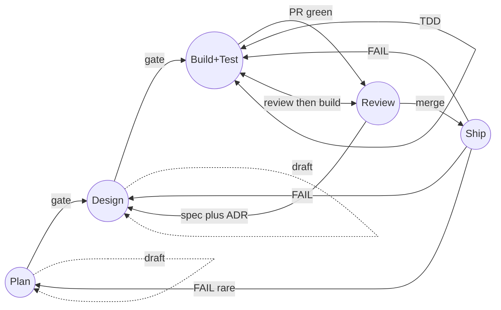

# Getting oriented to AI-DLC

How the seed fits together: layers, V-model vs tracker states, normal bounces, and where to read next. Process rules live in [templates/AIDLC.md](templates/AIDLC.md) (copy to consumer `docs/AIDLC.md`). Slash skills are cataloged in [SKILLS.md](SKILLS.md).

---

## Layers

| | |
|---|---|
| **This repo** | `skills/`, plugins, optional GitHub / Linear playbooks |
| **Your app repo** | `docs/AIDLC.md`, `AGENTS.md` (tracker + env), optional `.cursor/skills` overrides |
| **Transport** | Manual slash commands, and/or board state → Cursor Cloud Agent ([GITHUB-AIDLC-QUEUE.md](GITHUB-AIDLC-QUEUE.md), [LINEAR-AIDLC-PROJECT.md](LINEAR-AIDLC-PROJECT.md)) |

Adoption depth: skills only → consumer submodule → headless queue. Cross-cutting rules: [ARCHITECTURAL-SOUNDNESS.md](ARCHITECTURAL-SOUNDNESS.md), [INTENT-OVER-LITERAL.md](INTENT-OVER-LITERAL.md), [ASK-AND-HALT.md](ASK-AND-HALT.md).

| If you are… | Start with |
|-------------|------------|
| Trying skills locally | [INSTALL.md](INSTALL.md), [CLAUDE-MARKETPLACE.md](CLAUDE-MARKETPLACE.md) |
| Vendoring into an app | [CONSUMER-SETUP.md](CONSUMER-SETUP.md) |
| Wiring automation | [GITHUB-AIDLC-QUEUE.md](GITHUB-AIDLC-QUEUE.md) or [LINEAR-AIDLC-PROJECT.md](LINEAR-AIDLC-PROJECT.md) |
| Contributing here | [AGENTS.md](../AGENTS.md), [SKILLS.md](SKILLS.md) |

Example consumer transport: [alexa-recipe-app — linear-workflow.md](https://github.com/queen-of-code/alexa-recipe-app/blob/master/docs/linear-workflow.md).

---

## V-model (verification correspondence)

Not tracker columns. Each right-side phase **reads** the artifact from the matching left side.

```text
Plan ─────────────────────────────────── Validate (+ Learn)
  │  Define the problem · Product Spec   Verify it matches · scorecard
  │                                                   │
Design ─────────────────────────────── Review
  │  Tech Spec                         vs Tech Spec
  │                                       │
 Build ─────────────────────── Test
        Do the work                       Prove it works
                  │         │
                  └── TDD ──┘
```

| Define | Verify | Uses |
|--------|--------|------|
| Plan | Validate (+ Learn after PASS) | Product Spec |
| Design | Review | Tech Spec(s) |
| Build | Test | Code and tests from Build |

Time order: Plan → Design → Build ↔ Test → Review → Validate → Done. Full prose: [templates/AIDLC.md](templates/AIDLC.md) § The V-Model.

> **Agents implement. Orchestrators coordinate. Humans decide.**

---

## Tracker phase flow (bounces are normal)

Board states (Linear, GitHub **`AIDLC phase`**, etc.) move on **human gates** and automation. Two loop types:

- **Same column** — Plan/Design drafts until the human approves ([templates/AIDLC.md](templates/AIDLC.md) § Orchestration Model).
- **Board bounce** — ticket moves back (or Review ↔ Build+Test churn).

Forward path (names vary; set yours in `AGENTS.md`):

```text
Triage? → Plan → Design → Build+Test → Review → [In Staging?] → Ship → Done
```

GitHub merge advance: `Plan → Design → Build → Review → Ship` ([`aidlc-pr-merged.yml`](templates/github-workflows/aidlc-pr-merged.yml)). PR opened can set **Build → Review** ([`aidlc-pr-opened-review.yml`](templates/github-workflows/aidlc-pr-opened-review.yml)).



| Bounce | Trigger | Doc / skill |
|--------|---------|-------------|
| Review ↔ Build+Test | PR review threads, red CI | `/review` → `/build` ([build/SKILL.md](../skills/build/SKILL.md)); counts toward **bounce breaker** |
| Review → Design | Architectural-root fix needs Tech Spec + ADR | [ARCHITECTURAL-SOUNDNESS.md](ARCHITECTURAL-SOUNDNESS.md) |
| Ship → Build / Design / Plan | Validate FAIL; human moves column after `/ship` proposal | [templates/AIDLC.md](templates/AIDLC.md) § Iteration and Failure Model |
| Paused, not a bounce | `needs-a-human` | [ASK-AND-HALT.md](ASK-AND-HALT.md) |

**Circuit breakers:** Nth re-entry to Build+Test → stop agent ([LINEAR-AIDLC-PROJECT.md](LINEAR-AIDLC-PROJECT.md)); second same symptom without updated Tech Spec → [ARCHITECTURAL-SOUNDNESS.md](ARCHITECTURAL-SOUNDNESS.md). Launchers skip `needs-a-human` and in-flight mutex (`aidlc_work:in_progress`, `bot-working`).

**Headless dispatch:** [GITHUB-AIDLC-QUEUE.md](GITHUB-AIDLC-QUEUE.md) (architecture diagram + workflows). Operational (incident) V-model: [templates/AIDLC.md](templates/AIDLC.md) Part 2.
