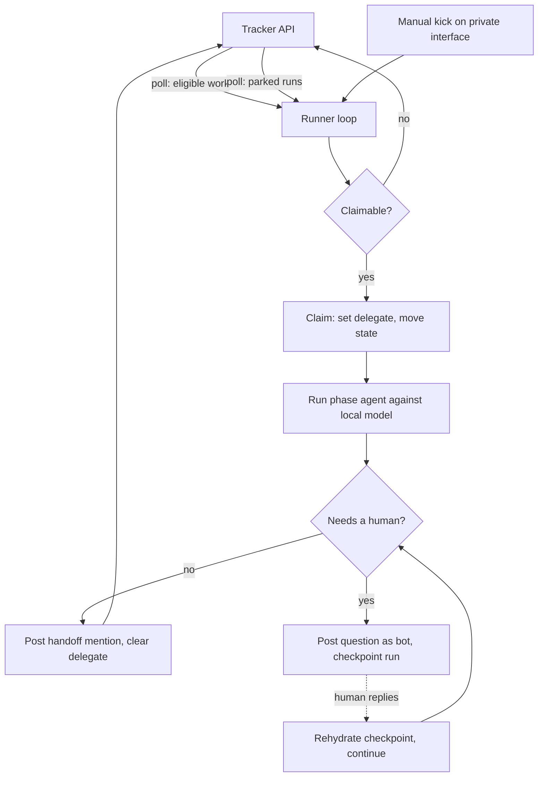

# Self-hosted AIDLC: phases on your own runner

**Using cloud agents?** Stop here. [LINEAR-AIDLC-PROJECT.md](LINEAR-AIDLC-PROJECT.md) and [GITHUB-AIDLC-QUEUE.md](GITHUB-AIDLC-QUEUE.md) already cover you. This doc is the **delta** for running the phase agents on **your own hardware against local models**, where the tracker cannot reach the runner.

Like the rest of the repo this is a SEED, derived from a working deployment, with placeholders instead of org names. It assumes the Linear transport as its base and notes where the same reasoning carries to the GitHub path.

## The one thing that inverts

Every cloud path in this repo dispatches **inbound**: a webhook fires, or a delegate is set, and something in the cloud receives it and starts a run. That works because the executor has a public address.

A self-hosted runner does not. It sits behind NAT on a home or office network, and the tracker has no route to it. So the dispatch arrow reverses, and one row of the Linear comparison table flips back:

| Cloud path | Self-hosted path |
|---|---|
| **Delegate = dispatch.** Setting a delegate launches the run | **Delegate = claim marker.** The runner polls for it |
| Webhook delivers the event | The runner asks for changes since its last cursor |
| Executor has a public address | Executor has no inbound surface at all |
| A dropped event is lost | A missed tick is picked up on the next one |

Everything else in [LINEAR-AIDLC-PROJECT.md](LINEAR-AIDLC-PROJECT.md) survives intact: **workflow states are the phases**, **human gates are state moves**, **specs are Documents on the Feature issue**, **slices are born inert**, and **automations authenticate as the bot**. Do not re-add `aidlc_work:*` labels to compensate. State plus delegate still carries the whole signal.

## Why not just expose the runner

You can put the runner behind a tunnel and take the webhook. Understand what that costs before you do.

If your tunnel is gated by a human identity provider (Google, Okta, SSO of any kind), the tracker's servers cannot complete that login. You end up cutting a **service token or a bypass policy scoped to one path**, which becomes the single machine-authenticable route into your network and the thing you will have forgotten about in six months. Polling needs no such exception, because nothing is listening.

The second cost is failure mode. A webhook delivered while the runner is down is a **dropped event**: the issue sits in an active state with nothing working it, and nothing retries. A poll loop that misses ticks while the runner is down simply catches up when it returns. For a self-hosted runner that reboots occasionally, that difference matters more than the latency does.

Take the webhook only if you need sub-minute dispatch **and** you are willing to own both the auth exception and a retry story.

## The loop

Two cadences, both outbound, both plain HTTPS to the tracker's API.

| Loop | Default | Why this cadence |
|---|---|---|
| **Eligible work** | `AIDLC_POLL_INTERVAL`, 10m | New work is waiting on a human gate anyway. Minutes are invisible |
| **Parked runs** | `AIDLC_POLL_INTERVAL_PARKED`, 30s | A parked run is blocking. The interval is round-trip latency on every question |

Splitting the two is the whole trick. One slow loop makes a three-question run cost an hour of pure waiting. Both loops are reads against the same API, so the fast one costs almost nothing.

Use a **cursor** (the `updatedAt` of the last processed change) rather than re-scanning the board every tick, and persist it, so a restart does not reprocess the world.

## Claiming, and not double-starting

Polling gives up exactly-once delivery, so the runner has to make double-start impossible rather than unlikely:

- **Claim before you work.** Set the delegate and move the state **first**, then start the run. A claim that happens after the work starts is not a claim.
- **Treat the claim as a compare-and-set.** Re-read the issue after writing. If the delegate is not yours, another worker or a human took it. Drop it and move on.
- **Key every run by issue id.** A run already in flight for that issue is the answer to "should I start one," not a reason to start a second.

This matters more than it does in the cloud paths, where `aidlc_work:in_progress` acts as a mutex against workflows that fire once. Here the loop will genuinely see the same issue twice.

## Slices born inert becomes a query constraint

[LINEAR-AIDLC-PROJECT.md](LINEAR-AIDLC-PROJECT.md) makes "slices are born inert" a **creation-time** rule: Design creates them in the backlog state, un-delegated, so nothing dispatches them.

On a polling runner that rule has to be enforced on the **read** side too. The eligible-work query must select on **phase state and delegate together**, never on "is a sub-issue of something active." A query that walks down from an active parent and picks up its children rebuilds the exact runaway-decomposition footgun the inert rule exists to prevent, except now the trigger is your own loop instead of a delegation event.

Release is unchanged: the parent's human gate releases the first unblocked backlog slice into the build state, and the loop picks it up on the next tick like any other eligible issue.

## Parked runs and the answer path

The cloud paths end a phase with a handoff `@mention` and stop. A self-hosted run that hits a mid-run question needs to **park and resume** instead, and the bot identity you already set up is what makes that work.

Because automations authenticate as a dedicated bot seat, an agent's question is **mechanically distinguishable** from a human thinking out loud in the same thread. You do not need a marker prefix convention, a `needs-input` label, or a new workflow state. The parked signal is structural:

> An issue is **parked** when its delegate is the bot and the **most recent comment is the bot's question**. It is **answerable** when a non-bot comment arrives after that question.

Resume rides on the orchestrator's existing session and checkpoint tables. Checkpoint the run keyed by issue id when you park, rehydrate on answer, continue in the same phase. The issue never leaves its state, so the board keeps meaning what it says.

Two things to decide for your deployment, because they are genuinely open:

- **Concurrent questions.** The simplest correct answer is to serialize: one open question per issue, and an agent that needs two things asks for both in one comment. Allowing several open at once means matching answers back to questions, which is a parsing problem you do not want.
- **Park timeout.** A run parked for days is holding a checkpoint and a delegate. Decide whether it expires back to the human, and at what age.

## Manual kick

Polling means the worst case for starting something is one full interval. A manual trigger removes that without adding any public surface:

- Expose a small endpoint on the runner bound to your **private network interface** (`AIDLC_RUNNER_BIND`), not `0.0.0.0`. On a mesh VPN that is the VPN interface. It is then unreachable from the LAN, let alone the internet.
- A phone shortcut doing a POST is enough. This is the "start it now" path, not a second dispatch mechanism, so it should do exactly what a tick does.

## Availability

Understand what your runtime is actually tied to before you rely on unattended runs.

If the phase agents run in containers under a **desktop container runtime**, that runtime is usually bound to a **logged-in session**. Screen lock is fine, the session persists. A **reboot** is not: the machine can be up, reachable, and disk-unlocked while the container runtime is still down, because nobody has logged in at the console yet.

Polling degrades correctly here, and that is most of why it is the right default. Nothing is dropped, the board stays accurate, and the loop catches up when the runtime returns. Decide deliberately whether unattended-after-reboot is a requirement. If it is, the container runtime has to be something launchable without a session, which is a real constraint on runtime choice.

## Model routing

Local models are good enough for build steps and noticeably weaker on spec writing and review. Do not make that an all-or-nothing choice.

Give the orchestrator a **model slot per agent** rather than one global model, so `/build` can run locally while `/plan`, `/review`, and the architectural-soundness pass escalate to a frontier API if you want them to. This is config, not architecture: nothing downstream depends on which model sits in which slot, and you can move them any time.

Keep the classifier and embedding slots local regardless. They are high-volume and low-difficulty, which is exactly where local inference pays.

## The platform-native build boundary

If your phase agents run in **Linux containers**, they cannot run a platform-native toolchain that only exists on the host. Xcode and the iOS simulator are the common case; anything needing a Windows or macOS SDK is the same shape of problem.

The agent can write and review that code perfectly well. It cannot build or test it. Your options are a **host-side runner** the orchestrator calls out to for the build and test step, or keeping platform-native work **human-in-the-loop** at that step. Decide which before you point AIDLC at a mobile or desktop repo, because Build+Test quietly does not close otherwise.

Do not solve it by giving the container host access. The isolation is the reason the agent runs in a container at all.

## Config

| Name | Purpose |
|---|---|
| `LINEAR_ROBOT_KEY` | Bot seat API key (as in [LINEAR-AIDLC-PROJECT.md](LINEAR-AIDLC-PROJECT.md)). All loop reads and writes use it |
| `AIDLC_POLL_INTERVAL` | Eligible-work cadence. Default 10m |
| `AIDLC_POLL_INTERVAL_PARKED` | Parked-run cadence. Default 30s |
| `AIDLC_RUNNER_BIND` | Interface for the manual kick endpoint. Private interface only, never `0.0.0.0` |
| `AIDLC_PARK_TIMEOUT` | Optional. Age at which a parked run returns to a human |
| Per-agent model slots | Which model each phase agent uses. See [Model routing](#model-routing) |

## Checklist

1. Complete the [LINEAR-AIDLC-PROJECT.md](LINEAR-AIDLC-PROJECT.md) setup first: states, bot seat, Documents, inert slices. This doc changes none of it.
2. Build the loop with **two cadences** and a persisted cursor.
3. Make claiming a **compare-and-set before work starts**, keyed by issue id.
4. Write the eligible-work query on **state plus delegate**, never by walking down from an active parent.
5. Implement **park and resume** on the orchestrator's existing checkpoint tables, using bot authorship as the parked signal.
6. Bind the manual kick to a **private interface**.
7. Decide **concurrent questions** (serialize is recommended) and **park timeout**.
8. Confirm whether your container runtime survives a reboot without a login, and decide whether that is acceptable.
9. If the repo is platform-native, decide the **build and test** story before running a Feature through.

## Links

- [LINEAR-AIDLC-PROJECT.md](LINEAR-AIDLC-PROJECT.md) - the base transport this doc modifies
- [GITHUB-AIDLC-QUEUE.md](GITHUB-AIDLC-QUEUE.md) - the cloud-dispatch equivalent
- [ISSUE-TRACKER-PORTABILITY.md](ISSUE-TRACKER-PORTABILITY.md) - declare your tracker in `AGENTS.md`
- [ARCHITECTURAL-SOUNDNESS.md](ARCHITECTURAL-SOUNDNESS.md) - prevent-by-construction, tracker-neutral
